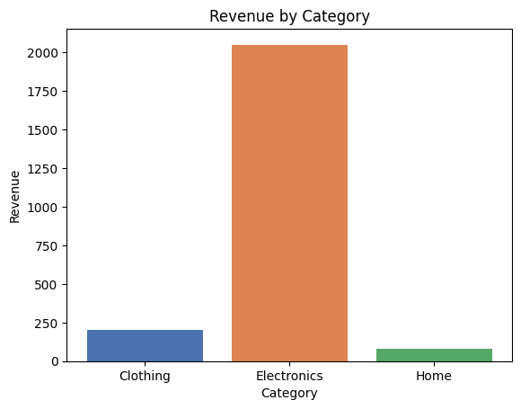
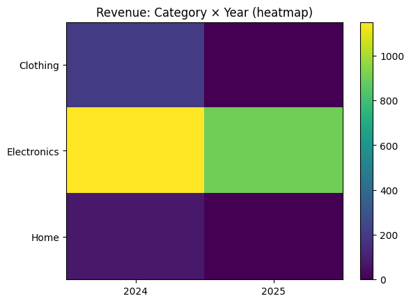
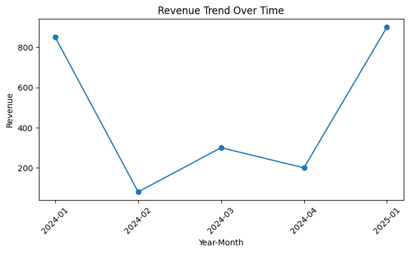

# OPAL Assignment 1 

This repository contains a short OLAP (Online Analytical Processing) demo implemented in a Jupyter Notebook. It demonstrates building a small dimensional model (products, dates, sales) in SQLite, running ROLAP queries, constructing a small in-memory cube with pandas (MOLAP style), and combining both approaches (HOLAP). It also contains simple visualizations.

## What is included

# OPAL Assignment 1 — OLAP examples with SQLite, pandas and matplotlib

This repository contains a short OLAP (Online Analytical Processing) demo implemented in a Jupyter Notebook. It demonstrates building a small dimensional model (products, dates, sales) in SQLite, running ROLAP queries, constructing a small in-memory cube with pandas (MOLAP style), and combining both approaches (HOLAP). It also contains simple visualizations.

## What is included

- `Assignment 1.ipynb` — The main Jupyter notebook. It:
  - creates three SQLite tables: `products`, `dates`, `sales`;
  - inserts sample dimension and fact rows;
  - runs example ROLAP SQL queries (category averages, yearly totals, product sales);
  - loads joined sales into pandas and builds a pivot table (cube) by category and year;
  - demonstrates slice, dice, roll-up and drill-down operations using pandas groupby;
  - produces three visualizations: bar chart (revenue by category), heatmap-like image (category × year), and a revenue trend line.
- `olap.db` — The SQLite database file created by the notebook (contains the tables and sample data).
- `Readme.md` — This file: overview, how to run, and notes.

## Data model and sample data

- products(product_id, category, name, price)
- dates(date, year, quarter, month)
- sales(sale_id, date, product_id, quantity, revenue)

The notebook inserts a handful of representative rows (Electronics, Home, Clothing categories; dates in 2024 and 2025) so you can immediately run the examples.

## Key queries and analyses implemented

Below are concrete items required in the README:

Project title and short description
- Title: OPAL Assignment 1 — OLAP examples with SQLite, pandas and matplotlib
- Description: A short demo showing how to model a small dimensional schema, run SQL (ROLAP) queries against SQLite, build an in-memory pivot/cube with pandas (MOLAP), and combine both approaches (HOLAP). The project also saves illustrative plots.

Schema (tables + columns)
- products
  - product_id (INTEGER PRIMARY KEY)
  - category (TEXT)
  - name (TEXT)
  - price (REAL)
- dates
  - date (TEXT PRIMARY KEY, formatted YYYY-MM-DD)
  - year (INTEGER)
  - quarter (INTEGER)
  - month (INTEGER)
- sales
  - sale_id (INTEGER PRIMARY KEY)
  - date (TEXT) — FK to `dates.date`
  - product_id (INTEGER) — FK to `products.product_id`
  - quantity (INTEGER)
  - revenue (REAL)

Example SQL queries used (saved as CSV in `outputs/data/`):
- q1_avg_revenue_by_category (ROLAP)
```sql
SELECT p.category, AVG(s.revenue) AS avg_revenue
FROM sales s JOIN products p ON s.product_id = p.product_id
GROUP BY p.category
ORDER BY avg_revenue DESC;
```
- q2_total_revenue_by_year (ROLAP)
```sql
SELECT d.year, SUM(s.revenue) AS total_revenue
FROM sales s JOIN dates d ON s.date = d.date
GROUP BY d.year
ORDER BY d.year;
```
- q3_quantity_by_product (ROLAP)
```sql
SELECT p.category, p.name, SUM(s.quantity) AS sold_qty
FROM sales s JOIN products p ON s.product_id = p.product_id
GROUP BY p.category, p.name
ORDER BY p.category, sold_qty DESC;
```

Short explanation of how each OLAP architecture / operation was implemented

- ROLAP (Relational OLAP):
  - Implemented by running SQL aggregation queries directly on the SQLite database (`olap.db`) using `pandas.read_sql_query`.
  - Examples: q1 (avg revenue by category), q2 (total revenue per year), q3 (quantity by product). Results are saved as CSVs under `outputs/data/`.

- MOLAP (Multidimensional OLAP):
  - Implemented in-memory with pandas pivot tables. We load the joined sales+product+date rows into a DataFrame and call `pd.pivot_table` to create a small cube (revenue by category × year).
  - The cube is saved as `outputs/data/cube_revenue_category_year.csv` and visualized with a heatmap-like image `outputs/images/heatmap_category_year.png`.

- HOLAP (Hybrid OLAP):
  - A hybrid approach is demonstrated by keeping detailed rows in SQLite (ROLAP) while constructing aggregate slices/cubes with pandas (MOLAP) for fast multidimensional queries. Detailed rows are saved as `outputs/data/details_sales.csv` while summaries are saved as pivoted CSVs.

- OLAP operations implemented in pandas (examples saved under `outputs/data/`):
  - Slice: filtering the DataFrame on a single dimension — example `slice_2024.csv` (year = 2024).
  - Dice: filtering on multiple dimensions — example `dice_q1_2024_electronics.csv` (year=2024, quarter=1, category=Electronics).
  - Roll-up: aggregating lower-level data to a higher level — example `rollup_category_year.csv` (revenue summed to category × year).
  - Drill-down: expanding an aggregate to more granular levels — example `drill_quarter_month_2024.csv` (revenue broken down by quarter and month for 2024).

These outputs are all produced by running `run_assignment1.py`, which reproduces the notebook's logic and writes CSVs and PNGs into `outputs/`.

## Visualizations

- Bar chart: revenue by category
- Heatmap-like image: category × year revenue (uses `plt.imshow` on the pivot table)
- Line chart: revenue trend over Year-Month (aggregated time series)

## How to run (Windows / PowerShell)

Prerequisites: Python 3.8+ and pip. If you don't want to modify the system environment, create and use a virtual environment.

Open PowerShell in the repository folder (`c:\Users\Admin\Documents\GitHub\opal_assignment-1`) and run:

```powershell
python -m venv .venv
.\.venv\Scripts\Activate.ps1
pip install --upgrade pip
pip install pandas numpy matplotlib jupyter
# then start the notebook server
jupyter notebook "Assignment 1.ipynb"
```

Once the notebook is open, run the cells from top to bottom. The notebook will create (or reuse) `olap.db` in the same folder, populate sample data, run queries, and display outputs and plots inline.

If you prefer not to run a Jupyter server, you can run the notebook non-interactively with `nbconvert` or convert it to a script; but interactive execution is recommended to inspect dataframes and charts.

## Outputs (generated by `run_assignment1.py`)

The repository now includes a small script `run_assignment1.py` that reproduces the notebook and writes CSVs and PNG images to `outputs/`.

### Data files (CSV) — location: `outputs/data/`

- `q1_avg_revenue_by_category.csv` — Result of ROLAP query q1: average revenue per product category.
- `q2_total_revenue_by_year.csv` — Result of ROLAP query q2: total revenue aggregated per year.
- `q3_quantity_by_product.csv` — Result of ROLAP query q3: total quantity sold per product (grouped by category and product name).
- `df_sales.csv` — Full joined sales table (sales + product + date attributes) used for pandas analyses and visualizations.
- `cube_revenue_category_year.csv` — The pivot table (MOLAP cube) showing revenue by category (rows) × year (columns).
- `details_sales.csv` — Raw `sales` table rows pulled from SQLite (fact table detail rows).
- `summary_pivot.csv` — Summary pivot of total revenue by category × year (similar to the cube).
- `slice_2024.csv` — Slice example: all sales rows filtered to year 2024.
- `dice_q1_2024_electronics.csv` — Dice example: rows where year=2024, quarter=1, category=Electronics.
- `rollup_category_year.csv` — Roll-up example: aggregated revenue at category × year level.
- `drill_quarter_month_2024.csv` — Drill-down example for 2024 aggregated at quarter × month.
- `trend_year_month.csv` — Aggregated revenue time-series by Year-Month (used to plot the trend line).
- `agg_revenue_by_category.csv` — Aggregated revenue by category (used for the bar chart).

You can open these CSV files in Excel, pandas, or any text editor for inspection.

### Images (PNG) — location: `outputs/images/`

1) Revenue by Category (bar chart)

`outputs/images/revenue_by_category.png`



Explanation: This bar chart displays total revenue summed per product category. Use it to quickly see which categories generate the most revenue.

2) Revenue: Category × Year (heatmap)

`outputs/images/heatmap_category_year.png`



Explanation: This visualization is a heatmap-like image of the pivot table (category rows × year columns). Darker/warmer colors indicate higher revenue. It helps spot which categories performed best in which years.

3) Revenue Trend Over Time (line chart)

`outputs/images/revenue_trend.png`



Explanation: This line chart shows aggregated revenue by Year-Month (e.g., 2024-01, 2024-02, ...). It is useful to observe short-term trends and seasonality.

---


